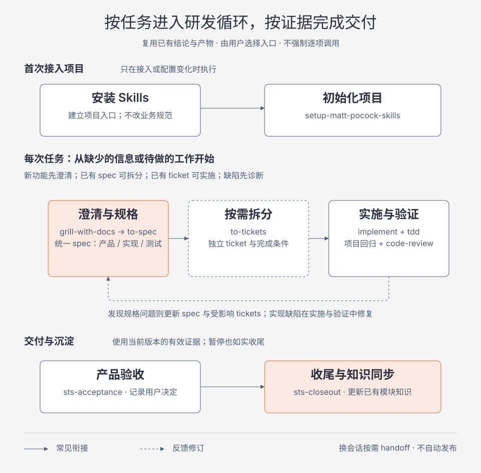

# spec-to-ship

面向个人与小团队的 AI 辅助研发工具包。**原生 Matt Skills 负责澄清、规格、任务、实施与验证；spec-to-ship 补充入口选择、产品验收和知识同步。**

包含固定版本的 **12 个 Matt Skills + 3 个自定义 Skills，共 15 个**。Matt 方法正文保持原文，仅对调用元数据做可追踪适配，不要求每个任务走完整流程，也不要求把已有 PRD／技术文档重写成 spec。来源和逐文件校验见 [SOURCES.md](SOURCES.md) 与 [manifest](upstream-manifest.json)。

## 1. 安装 Codex 插件

本仓库通过 repo marketplace 分发完整插件，不再逐项目创建 15 个软链接。先注册本地仓库，再安装：

```bash
codex plugin marketplace add /绝对路径/spec-to-ship
codex plugin add spec-to-ship@personal
```

`personal` 是本仓库 marketplace 的名称；若本机已有另一个同名 marketplace，先核对来源，不覆盖已有配置。安装后在新任务中核对插件来源、15 个入口及实际路径。插件安装不生成业务文档、不写项目规范；首次配置在业务项目中单独执行。发现、版本更新和旧链接迁移见 [项目接入](docs/project-setup.md)。

## 2. 首次初始化

在业务项目要求初始化，可通过 sts-workflow 衔接，也可直接调用 setup：

```text
请显式使用 $spec-to-ship:setup-matt-pocock-skills，
检查已有 AGENTS、CLAUDE 和文档约定，配置 Local Markdown tracker 与知识读取入口。
保留已有权威规范，不复制第二套规则。
```

初始化与安装分开，已有配置不必每个任务重跑。原生 setup 根据项目现状展示并确认配置，无需先手写模板。

文件放在哪里、哪些需要人审阅或提交 Git，见 [接入后的目录与维护方式](docs/project-setup.md#接入后的目录与维护方式)。目录按需生成，模块知识更新项目已有文档。

## 3. 开始一个任务

不确定入口时，用 `sts-workflow` 说明目标、已有材料和本次范围：

```text
$spec-to-ship:sts-workflow 我想改善客户资料的重复录入，现有说明在 docs/customer.md。
请先判断还缺哪些产品决定，这轮只澄清，不改代码。
```

已有清楚任务可以直接继续：

```text
$spec-to-ship:sts-workflow 按 docs/import-prd.md 和 docs/import-design.md 继续未完成的导入功能。
复用已有材料，不重写 spec；先核对当前代码与证据，暂不提交。
```

`sts-workflow` 负责一次进入、按需推进：明确小改动可直接处理；需要 Matt 方法时实际执行同包 Skill，用户无需逐阶段补调用命令。**它不会无条件自动跑完所有原生 Skills。** 已授权交付时按需主动衔接产品验收和收尾与知识同步，无须逐个手动触发；用户最终认可仍单独记录。熟悉入口后仍可直接调用 `implement`、`diagnosing-bugs`、`code-review` 等。

短名只在插件来源已确认时使用；有歧义时明确指定 spec-to-ship 插件，并使用宿主报告的当前插件内 Skill 绝对路径。依赖绑定同一插件，业务材料始终读取当前业务项目。

## 从哪里进入



完整的可复制开场、Agent 行为、用户参与点和完成产物见 **[场景使用指南](docs/usage-guide.md)**；范围、证据与原生调用规则以 [workflow.md](workflow.md) 为准。[HTML 源图](docs/diagrams/workflow-overview.html) 可下载后离线查看，GitHub 页面展示的是源码。

想先看协作方式，读 [完整功能协作图](docs/usage-guide.md#一次完整功能如何协作)；想知道文档如何关联、知识如何保留，读 [产物与知识关系图](workflow.md#产物与知识关系)。

## 范围与目录

- [插件包](plugins/spec-to-ship/)：12 个原生 Skills，`sts-workflow`、`sts-acceptance`、`sts-closeout`；验收与收尾模板按需使用。
- [repo marketplace](.agents/plugins/marketplace.json) · [插件清单](plugins/spec-to-ship/.codex-plugin/plugin.json)。
- [项目接入](docs/project-setup.md) · [场景指南](docs/usage-guide.md) · [流程合同](workflow.md)。
- [来源](SOURCES.md) · [逐文件 manifest](upstream-manifest.json) · [随包许可证](plugins/spec-to-ship/licenses/) · [维护要求](AGENTS.md)。

已授权工作连续推进，产品取舍与新增权限仍由用户决定。验收优先展示当前结果；任务证据按需精简，长期知识按业务模块维护当前能力，中文项目可使用中文模块文件名。详见[日常使用](docs/usage-guide.md#日常怎样少操作少产物)。

业务知识和真实产物留在业务项目。本仓库不建立流程 CLI、看板、状态机或全局控制器。原生 `implement` 含提交动作，`code-review` 仅覆盖已提交差异，均需遵守 [版本与权限合同](workflow.md#版本证据与权限)。工具链检查及隔离场景试用不能替代目标宿主发现、真实业务验证或用户验收。
