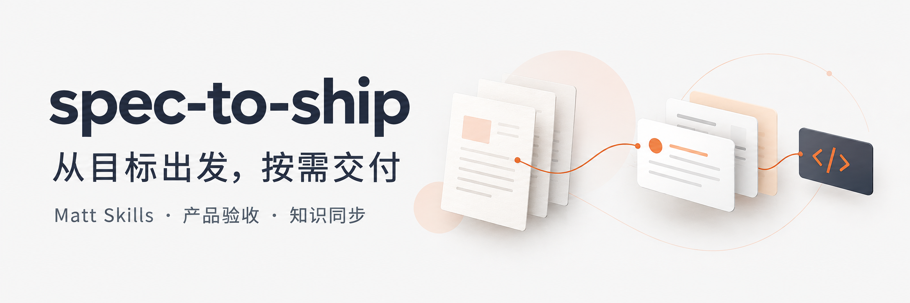
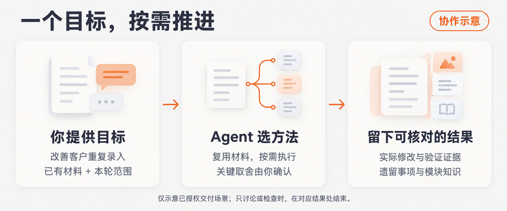

# spec-to-ship



面向个人与小团队的 AI 辅助研发工具包。从一个目标或已有需求开始，让 Agent 在授权范围内推进工作，并保留可核对的结果与项目知识。

**日常从 `$spec-to-ship:sts-workflow` 开始，说明目标、已有材料和本次范围即可。**

- **按需选方法**：原生 Matt Skills 负责澄清、规格、任务拆分、实施、测试与审查；明确的小改动可以直接处理。
- **复用已有材料**：已有足够的 PRD／技术文档就继续使用，无需重写成 spec，也无需每个任务走完整流程。
- **保留结果与知识**：spec-to-ship 补充入口选择、产品验收和知识同步，业务产物留在业务项目。

共 **15 个 Skills：12 个固定版本的 Matt Skills + 3 个自定义 Skills**。Matt 方法正文保留原文，仅适配调用元数据；来源和校验方式见 [SOURCES.md](SOURCES.md)。流程规则统一以 [workflow.md](workflow.md) 为准。

[安装与初始化](#1-安装-codex-插件) · [开始任务](#3-开始一个任务) · [选择入口](#从哪里进入) · [验证状态](#验证状态) · [完整使用指南](docs/usage-guide.md)

## 1. 安装 Codex 插件

先准备 Git 和支持插件命令的 Codex。本仓库通过 repo marketplace 分发完整插件，克隆到本机后注册并安装：

```bash
git clone https://github.com/xueruiy/spec-to-ship.git
cd spec-to-ship
codex plugin marketplace add "$(pwd)"
codex plugin add spec-to-ship@personal
```

已有本地仓库时，在该仓库目录执行最后两条命令即可。`personal` 是本仓库 marketplace 的名称；若本机已有同名 marketplace，先核对来源，保留已有配置。

安装后，用以下命令核对注册和安装情况，再开启新任务确认宿主发现全部 15 个入口、来源与实际路径：

```bash
codex plugin marketplace list
codex plugin list
```

保留本地仓库作为更新来源。插件安装与业务项目初始化分开：安装只准备 Skills，项目配置在下一步完成。版本更新、同名 Skill 处理和旧链接迁移见 [项目接入](docs/project-setup.md)。

## 2. 首次初始化

在**需要使用这套工具的业务项目**中开启任务，发送以下指令。已有配置的项目可跳到下一节。

```text
请显式使用 $spec-to-ship:setup-matt-pocock-skills，
检查已有 AGENTS、CLAUDE 和文档约定，配置 Local Markdown tracker 与知识读取入口。
保留已有权威规范，不复制第二套规则。
```

原生 setup 会检查项目现状，展示并确认配置，再按有效授权写入。也可以让 `sts-workflow` 衔接初始化，无需先手写模板或在每个任务重跑。

文件放在哪里、哪些需要人审阅或提交 Git，见 [接入后的目录与维护方式](docs/project-setup.md#接入后的目录与维护方式)。目录按需生成，模块知识更新项目已有文档。

## 3. 开始一个任务



图中是已授权交付的协作示意；只讨论或检查时，在对应结果处结束。

不确定下一步时，描述目标和本轮范围：

```text
$spec-to-ship:sts-workflow 我想改善客户资料的重复录入，现有说明在 docs/customer.md。
请先判断还缺哪些产品决定，这轮只澄清，不改代码。
```

已有需求或进行中的任务时，给出材料位置和操作边界：

```text
$spec-to-ship:sts-workflow 按 docs/import-prd.md 和 docs/import-design.md 继续未完成的导入功能。
复用已有材料，不重写 spec；先核对当前代码与证据，暂不提交。
```

示例中的文件路径请替换为业务项目的实际位置。

`sts-workflow` 根据现有材料与授权选择并执行所需方法，无需逐阶段补调用命令：

- 只讨论、诊断或检查，就在对应结果处结束。
- 已授权交付，就按需衔接实施、验证、产品验收、收尾及知识同步。
- 遇到新的产品取舍或额外权限，再请用户决定；用户最终认可单独记录。

一次进入不代表自动执行全部 Skills。更多可复制开场见 [场景使用指南](docs/usage-guide.md)。

短名只在插件来源已确认时使用；有歧义时明确指定 spec-to-ship 插件，并使用宿主报告的当前插件内 Skill 绝对路径。依赖绑定同一插件，业务材料始终读取当前业务项目。

## 从哪里进入

日常优先使用 `sts-workflow`；明确知道需要哪种能力时，也可直接调用以下入口。表中名称均使用 `$spec-to-ship:<名称>` 调用。

| 当前需要 | 入口 |
| --- | --- |
| 判断下一步，或继续已有任务 | `sts-workflow` |
| 系统澄清产品目标与待决问题 | `grill-with-docs` |
| 将已明确的讨论整理为持久规格 | `to-spec` |
| 按独立交付结果与依赖拆分任务 | `to-tickets` |
| 按已有规格或任务实施与测试 | `implement` |
| 诊断异常或性能问题 | `diagnosing-bugs` |
| 审查已提交差异 | `code-review` |
| 对照已确认标准验收产品行为 | `sts-acceptance` |
| 整理交付、遗留事项与模块知识 | `sts-closeout` |

完整入口及配套资源见 [Skills 目录](plugins/spec-to-ship/skills/)。`implement` 含提交动作，`code-review` 仅覆盖已提交差异；操作授权与工作区审查方式见 [版本与权限合同](workflow.md#版本证据与权限)。

<details>
<summary>展开详细入口选择图</summary>


</details>

各场景的 Agent 行为、用户参与点和完成产物见 **[场景使用指南](docs/usage-guide.md)**。[HTML 源图](docs/diagrams/workflow-overview.html) 可下载后离线查看，GitHub 页面展示的是源码。

想先看协作方式，读 [完整功能协作图](docs/usage-guide.md#一次完整功能如何协作)；想知道文档如何关联、知识如何保留，读 [产物与知识关系图](workflow.md#产物与知识关系)。

## 验证状态

以下摘要来自 **2026-09-11 的[验证记录](docs/invocation-validation.md)**，对应插件版本 `0.1.0+codex.20260911025611`，用于说明当时已覆盖的范围。

| 范围 | 已有证据与边界 |
| --- | --- |
| 插件包与原生文件 | 包校验、原生 hash、依赖资源及自定义 Skill 校验通过 |
| 隔离行为试用 | 在临时项目通过文件加载执行澄清依赖与规格生成；使用已确认需求夹具，不代表完整真实用户访谈 |
| 安装与宿主发现 | 重装缓存与源包一致；独立 Codex app-server 发现全部 15 个新版本入口，不证明旧会话已刷新 |
| 真实业务全链路 | 尚未验证 tickets、implement、提交、导出或产品验收的完整业务链路 |

使用时仍需在目标宿主的新任务中核对来源与发现情况。业务结果按当前需求和环境验证，用户最终验收另行记录。

## 文档与目录

- [插件包](plugins/spec-to-ship/)：12 个原生 Skills，`sts-workflow`、`sts-acceptance`、`sts-closeout`；验收与收尾模板按需使用。
- [repo marketplace](.agents/plugins/marketplace.json) · [插件清单](plugins/spec-to-ship/.codex-plugin/plugin.json)。
- [项目接入](docs/project-setup.md) · [场景指南](docs/usage-guide.md) · [流程合同](workflow.md)。
- [验证记录](docs/invocation-validation.md)：工程检查、隔离试用与宿主发现的证据和限制。
- [README 图片生成提示词](docs/images/generation-prompts.json)：横幅与协作示意的生成来源，便于后续维护。
- [来源](SOURCES.md) · [逐文件 manifest](upstream-manifest.json) · [随包许可证](plugins/spec-to-ship/licenses/) · [维护要求](AGENTS.md)。

已授权工作连续推进，产品取舍与新增权限仍由用户决定。验收优先展示当前结果；任务证据按需精简，长期知识按业务模块维护当前能力，中文项目可使用中文模块文件名。详见[日常使用](docs/usage-guide.md#日常怎样少操作少产物)。

业务知识和真实产物留在业务项目。本仓库提供 Skills、接入说明与验证辅助脚本，不建立流程 CLI、看板、状态机或全局控制器。
