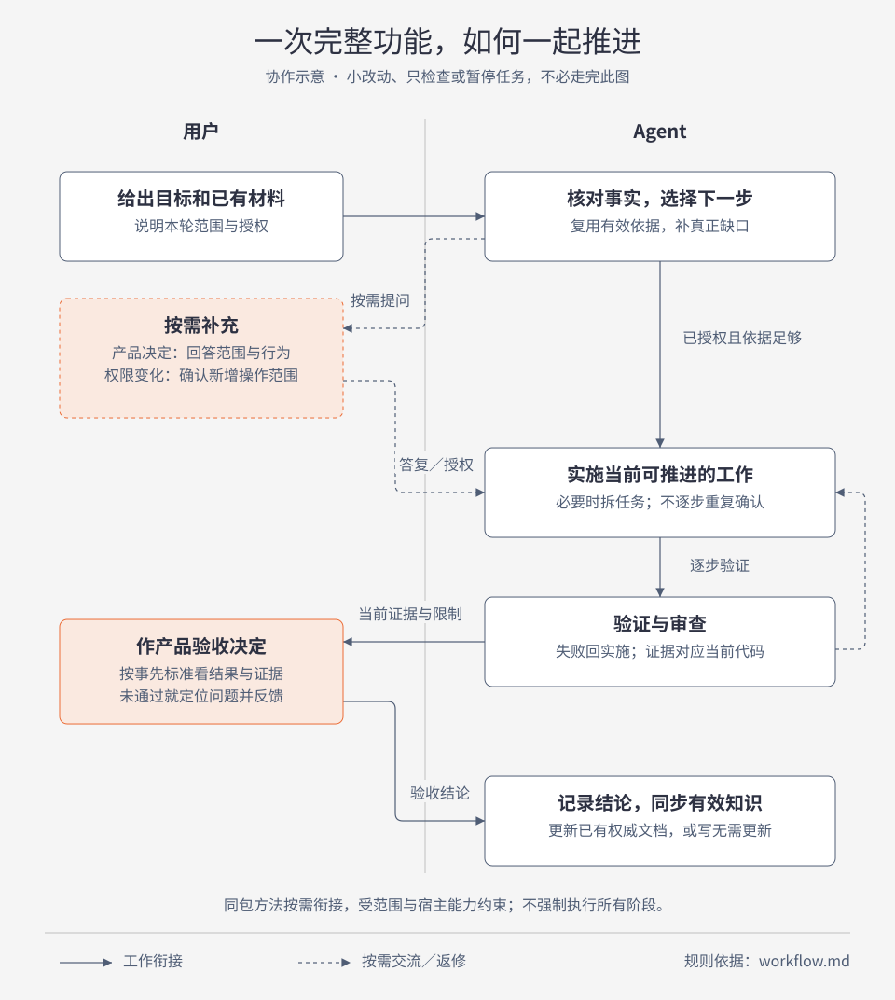

# 从当前任务开始

本指南给开场方式和预期协作，不另定义流程；范围、证据、原生调用条件以 [workflow.md](../workflow.md) 为准。首次使用先完成 [安装与初始化](project-setup.md)。安装后共有 15 个 Skills，日常不必记住全部名称。

`$spec-to-ship:sts-workflow` 帮你判断现在该做什么：已有足够依据就复用，缺重要决定才询问。它可处理明确的小工作，并在宿主支持、原生调用条件满足时衔接相应能力；遇到原生显式触发限制会给出下一条具体调用，不会静默跑完整研发链。熟悉入口后也可直接用 `$spec-to-ship:implement`、`$spec-to-ship:diagnosing-bugs` 等原生能力。

以下路径与业务内容只是示例，替换为自己的材料。先核对短名对应 spec-to-ship 插件；有同名入口时明确选择该插件，并使用宿主报告的当前 Skill 实际路径，其原生依赖也绑定同一插件。业务文件路径相对于当前项目，不相对于插件缓存。

## 一次完整功能如何协作



这是完整功能的协作示意，不是每个任务都要走完的阶段清单。Agent 在已授权且依据足够的范围内持续推进；必要产品决定由用户回答。只有原生调用条件或宿主要求显式触发时，才给出具体调用入口，不能把选用建议记为已执行。未通过验收时按问题返回实施或澄清，不能直接记为成功交付。

[离线 HTML 源图](diagrams/feature-collaboration.html) · [产物与知识关系](../workflow.md#产物与知识关系)

## 不确定要做什么：先把目标讲清

适合有痛点但产品行为还未确定的情况。不要先猜一套实现再让用户批准。

```text
$spec-to-ship:sts-workflow 我们的用户经常重复填写客户资料，我想减少重复操作。
请先查现有流程，帮我明确要改善的行为和完成标准；这轮只讨论，不改代码。
已有产品说明在 docs/customer.md。
```

**Agent 会做什么：** 查现有事实，分清问题与设想，选择澄清入口。可查的问题自己查；必须由用户决定的范围或行为集中说明。原生 `grill-with-docs` 需要显式调用时，给出其插件内实际路径及这次要澄清的具体问题。

**用户参与：** 决定服务谁、哪些场景纳入、异常或边界如何表现，以及可观察的完成标准。用户说“还没定”不会被记为批准。

**结束时得到：** 已确认结论、仍待决定事项和下一步。需要持久规格且现有材料不足时，再显式调用 `to-spec` 整理成原生 spec；本轮不会提前实施。

## 已有材料或任务：先判断还能不能用

是否需要新 spec，取决于信息是否足够，不取决于文件名。已有 PRD 和技术文档可以继续作为权威依据。

```text
$spec-to-ship:sts-workflow 需求在 docs/import-prd.md，技术决定在 docs/import-design.md，
未完成任务在 .scratch/import/issues/。请核对它们与当前代码是否一致，
从仍未完成的部分继续；不要重写一份 spec，也不要重复已完成的工作。先不提交。
```

**Agent 会做什么：** 读取指定材料、确认记录、任务依赖与工作区，区分“写了完成”与有当前证据支持的完成。信息足够就交给原生 `implement`；确有多个独立交付或依赖需要管理才用 `to-tickets`，无需先重新生成 spec。

**用户参与：** 解决材料间的实质冲突、过期需求或缺失决定；已有明确决定不重复询问。若所选原生能力要求显式调用，执行 Agent 给出的那一条调用即可。

**结束时得到：** 已复用的材料入口、实际继续的工作或尚待显式调用的具体下一步。修改发生时记录验证结果；不额外生成平行规格套件。

## 改动已明确：按影响范围决定是否拆分

一处文案、一条明确校验或一个已清楚的小修复，不必为了工具建立 spec 和 tickets。

```text
$spec-to-ship:sts-workflow 把设置页“保存成功后点击返回按钮。”改成“保存成功后，点击返回。”。
这是已确认的文案，不改交互逻辑；请直接修改并检查差异，不提交。
```

**Agent 会做什么：** 找到实际入口，完成范围内的修改和适用检查，简短报告。不会因为尚无 tracker 配置而阻塞，也不会调用整套实施流程。

**用户参与：** 正常无需新增决定；只有发现实际范围超出描述时，才确认受影响部分。

**结束时得到：** 修改和验证证据，留在现有任务或回复中。较大的明确功能可直接用 `implement` 输入现有规格；只有依赖或交付粒度确有必要时才拆票。

## 结果不对或想改善：先分清缺陷与新目标

“违反已有预期”和“想换一种体验”需要不同起点。

```text
$spec-to-ship:sts-workflow 搜索“北京”应返回名称含北京的客户，现在返回空列表。
请先复现和定位原因，预期行为见 docs/search.md；这轮只诊断，不修复。
```

**Agent 会做什么：** 核对预期、环境与复现条件，按适用策略使用 `diagnosing-bugs`。证据不足会报告缺什么；不会直接猜根因，诊断授权也不会因原生含修复步骤而扩展为修改代码。

```text
$spec-to-ship:sts-workflow 我觉得批量导入体验不好，想优化，但还没确定要改哪部分。
请先观察现有流程，帮我区分等待时间、错误反馈和操作步骤的问题，先不实施。
```

**Agent 会做什么：** 澄清想改善的可观察结果。性能问题先收集基线和测量条件；交互变化先确认产品行为，不任意发明时延目标或把所有“优化”当 bug。

**用户参与：** 提供无法从环境取得的复现条件，确认新目标或是否进入修复。已有修复授权可直接进入修复与回归，不重复询问。

**结束时得到：** 实际复现、原因依据或明确的证据缺口；优化场景得到已定义目标与待决定项。只有授权修复后才交付代码变更。

## 只要检查：结果就是本轮终点

这三个开场互相独立，选择本次需要的一个。

```text
$spec-to-ship:sts-workflow 只运行 python3 -m unittest discover -s tests，报告失败与覆盖。
不要修复代码，不生成产品验收结论。
```

```text
$spec-to-ship:sts-workflow 只审查当前未提交差异是否符合 docs/requirements.md。
请列出具体问题和覆盖范围，不运行测试、不修复、不提交。
```

```text
$spec-to-ship:sts-workflow 只验收当前导入功能，标准在已确认的 docs/import-prd.md。
已有测试结果在 .scratch/import/checks.md；请先核对版本是否仍有效，不改代码。
```

**Agent 会做什么：** 测试场景实际运行并报告结果；工作区审查实际读取差异，明确它不是原生 `code-review` 的 `base...HEAD` 审查；验收场景使用有效的既定标准和当前证据。要使用原生审查时，用户提供基线和材料路径，审查范围限于已提交 HEAD。空差异不会被记为“代码已审查通过”。

**用户参与：** 只在缺必要环境、基线或标准时补充信息；产品验收的最终用户决定单独确认。是否修复发现的问题由已有授权或新的用户要求决定。

**结束时得到：** 测试结果、审查发现或验收记录中的一种，包含未执行／未覆盖的部分。不会自动实施、创建 tickets、调用收尾或宣称交付完成。

## 中断后继续，或决定先停下来

交接记录是入口，不是对当前工作区的证明。

```text
$spec-to-ship:sts-workflow 根据 .scratch/export/handoff.md 恢复任务。
先核对当前代码、未提交改动、上次证据和待确认决定，继续不依赖未决项的已授权工作。
如果必须由我选择，先指出问题，不替我决定；暂不提交。
```

**Agent 会做什么：** 比较旧版本与当前工作区；相关变化使旧证据失效时，标记需重新验证。先解决阻塞用户决定，再做依赖它的实现；可继续的工作与不能继续的工作分开报告，不重走已有足够依据的阶段。

```text
$spec-to-ship:sts-workflow 这项功能先暂停。请整理当前完成与未完成内容、证据和恢复入口，
只同步已经确认且值得保留的模块知识；不把它记为成功交付，不提交。
```

**用户参与：** 决定待选行为、是否恢复或暂停；准备成功交付时，对产品验收作最终确认。

**结束时得到：** 恢复场景是实际进展、需要重验的范围及具体下一步；暂停场景是可恢复的状态和真实未完成结论。准备交付时再做适用回归、覆盖当前版本的审查、验收和知识同步。`sts-closeout` 可在已有任务留简短记录，`handoff` 只在换会话确有需要时生成。

## 看懂 Agent 的回答

一个有用的进度答复应让你知道：本次选了什么入口、依据在哪里、哪些动作实际执行、哪些还需要你的决定或原生显式调用。**“建议下一步用 implement”不等于代码已经实施，“检查失败后停止”也不等于任务交付。** 所有继续行为仍以 [当前范围与证据合同](../workflow.md) 为准。
