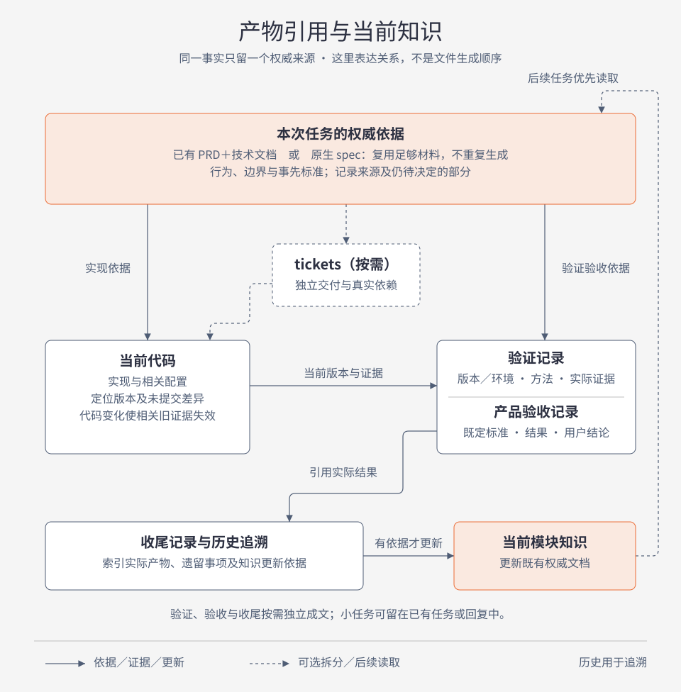

# 原生 Matt 研发流程与补充职责

当前路线：以固定版本原生 Matt Skills 完成研发过程，spec-to-ship 提供接入、验收与当前知识同步。用户一次选择 sts-workflow，Agent 在本轮范围内按需执行同包 Matt 方法；也可直接选择单个 Skill。阶段是职责导航，不是自动状态机；方法正文和实质决定的确认行为保留。这里不强制七次交接或五个状态。

## 选择入口与复用产物

首次接入与日常工作分开：安装只准备 Codex 插件中的 Skills；用户要求首次接入时，由入口衔接 setup 或直接调用 setup，检查既有项目规范后初始化。日常可直接调用原生能力，也可用 sts-workflow 根据目标、已有依据与授权选择下一步。

sts-workflow 先辨别用户要探索、改动、诊断、只检查、验收还是恢复／暂停，检查与此相关的材料、代码和证据，再说明选用入口。范围已明确的工作直接推进，重要产品决定先问清再做依赖工作。用户只要建议时给建议，只要测试或审查时在对应结果处结束，不自动升级到修复、验收或成功交付。

### 连续执行与及时反馈

用户已授权按依赖完成任务时，完成一项、解除阻塞或修复后继续下一项，不以阶段结束为由反复等待“继续”。常规实现和测试细节沿用已有授权；新的实质产品决定、额外权限或真实宿主阻塞才需要用户参与；无需逐阶段重新调用 Skill。纯检查和暂停仍在本次范围内结束，不能扩大为修复或交付。

界面变化在首个可操作版本尽早展示关键交互，检查主操作、信息层级和入口归属；不强制先制作整套设计稿。新产品决定确认后，立即更新权威需求、受影响任务及验收标准，不等收尾才纠正旧描述。

### 后续反馈与任务归属

每轮结合原目标、新反馈和有效授权判断：范围内调整沿用授权；实现缺陷按有效修复授权返回实施与复验，仅检查时报告发现；追加或变更需求同步原有权威材料、受影响任务与完成标准；仅讨论不实施；独立新任务另行明确范围与材料归属，不混用完成状态，也不强制新建会话。

需求是否变化与是否已经授权分别判断。采用用户最新明确决定，不把 Agent 先前建议当必备条件；已明确授权实施不重复确认。实现受限时保留未完成范围，或提出具体待决取舍，不能默默缩小已确认需求。普通追问不新增文件。写入前核对原目标、范围和完成标准是否仍属同一任务；同一任务更新原材料，跨范围的新任务按项目约定另定归属并引用旧依据。主题相关不等于属于同一任务，复用依据不等于把新需求追加进历史计划。需要持续追踪时才成文，事实、已确认决定和建议分别标明。

继续或恢复前核对当前版本、有效依据、授权、未完成项和证据有效性。环境或工具受阻时记录未验证项、原因、恢复条件与入口；话题变化不等于旧任务完成或取消。恢复条件满足且仍属有效授权范围时继续相关工作，不默认创建后台调度。

研发入口在已授权交付范围内主动按需衔接产品验收及收尾与知识同步，实际读取相应自定义 Skill 并执行，不要求用户逐个触发；只讨论、检查或暂停仍按本轮范围结束。一次调用不是程序状态保证，也不自动触发全部原生 Skills；报告实际执行、覆盖与剩余事项，用户最终认可不由 Agent 代签。

任务委派给子 Agent 或独立会话时传递有效需求、范围、授权与验收标准；回收时核对版本与证据，主任务负责集成与整体验收。委派不扩大授权，独立会话需读取适用项目规则和 Skill；本规则不自动创建会话。

### 材料足够就复用

已有已确认 PRD、技术文档、计划、原生 spec、ticket 或明确讨论，只要包含当前任务所需的行为、边界和完成标准，都可作为依据。记录权威位置和版本即可，不因名称、格式或缺少 spec.md 重建同样内容。材料冲突先定位待决问题；缺少标准才补充澄清，不能按实现倒推标准。

需要持久规格且缺少足够材料时使用原生 to-spec；已有等价材料时可直接交给 implement 或 to-tickets。implement 原生接受 spec 或 tickets，不要求先拆票；to-tickets 原生接受 plan／spec／conversation，不要求先换成统一模板。不会同时维护两套相互竞争的规格。

### 入口与结束范围

| 判断 | 处理 |
| --- | --- |
| 目标模糊、新行为未定 | 核实可查事实，澄清目标与标准；不提前实现依赖未决选择的行为 |
| 改动明确、单一且低风险 | 直接必要修改与验证，可在现有任务或回复留证；不强制 spec／tickets／验收／收尾文件 |
| 多个独立结果或真实依赖 | 按需拆 tickets；复用现有材料，不为阶段形式拆票 |
| 异常、性能偏离既有目标 | 建立基线与复现，按授权诊断或修复；泛泛“优化体验”先定义目标，不能一概当 bug |
| 只测试 | 执行指定或适用检查，报告失败和覆盖；不默认修复，不强制 TDD 或产品验收 |
| 只审查 | 审读指定范围并列发现；未提交差异可明确标为工作区人工审读，不能冒称原生 base...HEAD 已覆盖 |
| 只验收 | 对已有标准验收当前证据，缺标准返回澄清；不默认改代码或代替用户确认 |
| 恢复中断 | 比较旧交接与当前版本、未提交差异、环境、旧证据和待决项，先判明可继续部分，不能把历史建议当批准 |
| 暂停／结束 | 按用户范围记录实际结果和下一步；暂停不冒称成功交付，handoff 和知识更新按需 |

### 原生调用与宿主限制

统一入口负责选中并实际执行适用的同包 Matt Skill，不以推荐下一条调用代替推进。包内六个原本显式限定的入口已通过可追踪调用元数据适配开放自动选择；方法正文、模板和依赖保持固定上游。用户无需逐阶段重选 Skill，直接指定单个入口的用法仍保留。自动选择只解决方法调用，不扩大实施、提交、发布或业务配置授权。

目标模糊且需要系统访谈时执行 grill-with-docs 及其 grilling、domain-modeling 依赖；普通事实追问不强制访谈。决定收敛且本轮需要持久规格时执行 to-spec，材料足够则复用；需要独立交付管理时执行 to-tickets；已授权实施才进入 implement。只讨论时停在讨论结果，不能因为入口可自动调用就自行写规格或实施。原生方法中的确认优先复用已有明确决定；未决取舍仍向用户提出，不用阶段确认重复索要同一授权。

同名依赖绑定到当前 spec-to-ship 插件的同一 `skills/` 目录，先核对宿主发现的来源与实际路径，不假定它覆盖全局或旧项目版本。业务规则、配置、任务产物和模块知识始终读取或写入当前业务项目，不写入插件缓存。核实宿主支持的 Skill 加载与执行方式，实际读取指令并完成适用步骤；只读文件不算执行。有 Skill 工具时使用该工具；Codex 文件加载型宿主将原生“Call/Load Skill”映射为读取同包指令并实际执行及递归加载依赖，报告为文件加载执行，不声称发出了 Skill 工具调用。无可用加载机制或必需子 Agent、业务工具确实缺失时报告受阻步骤，不伪造依赖执行或独立审查；可继续不依赖该能力且已授权的工作。已有项目不重复初始化；不依赖 tracker 的明确小改动或已有命令测试，不以补齐 setup 文件为前置条件。

## 按产品结果验证

实施前从已确认材料定位可观察的用户结果、边界和完成标准；缺少影响实现的重要标准先澄清，不按做出的代码倒推。检查范围随改动影响确定，覆盖结果及必要的后续使用；中间操作成功、测试或构建通过，只证明各自实际覆盖的部分，不能替代最终结果。

性能改进先定位主要耗时，以用户感知的实际完成点为指标，在可比条件下验证前后结果；区分不同使用条件以及反馈与完成，不用局部改善代表整体目标达成。复用已有能力时核对适用条件、当前场景行为和限制，不以接入成功代表适配完成。具体业务检查项由项目需求决定，不将某项目案例提升为全局清单。

按“标准、实际结果、版本与证据、缺口”记录，区分实现完成、验证完成和用户认可。保留未运行、失败、阻塞及失效结论；相关变化后只复验受影响部分，不能把旧通过自动继承给新版本。

## 从目标到验收

| 目的与入口 | 开始前读取 | 产物／完成依据 | 接下来读取 |
| --- | --- | --- | --- |
| 澄清：grill-with-docs | 用户目标、项目执行规则、当前模块知识；按原生流程核查代码 | 共同理解及已确认决定；调用 grilling、domain-modeling，按需维护词汇或重要决定 | 讨论结论、现有领域文档 |
| 统一规格：to-spec | 澄清结论、代码理解、tracker 配置 | 原生 spec 的产品问题、方案、用户故事、实现与测试决定、非目标；待决的实质问题回到澄清 | spec 及决定依据 |
| 交付拆分：to-tickets（按需） | spec 或已明确计划、依赖和领域知识 | 可独立验证的原生 tickets、完成条件和阻塞关系；按原生流程确认拆分 | 当前可开始 ticket、spec、依赖 |
| 实施与测试：implement | spec／ticket 或等价材料、项目规则与验证入口、当前代码基线 | 原生 tdd 行为测试循环；适用检查通过，阻断问题解决，证据对应当前实现；原生 code-review 与提交按授权处理 | 代码、实施反馈、测试结果 |
| 最终回归与审查：项目检查 + 适用审查 | 交付范围、规格依据（spec 或等价材料）、基线、最新 HEAD 与未提交差异 | 项目必需回归通过，审查证据覆盖最终交付内容；按改动状态选择原生审查或工作区人工审读，未覆盖项显式说明 | 当前版本检查与审查证据 |
| 产品验收：sts-acceptance | 权威材料中事先明确的标准、已有任务、当前证据与真实环境 | 逐规格条目实际结果及证据、用户最终结论；无需 R／AC 编号 | 验收结果、限制与后续事项 |
| 收尾：sts-closeout | 实际存在的需求／技术材料、任务、验证验收、当前权威模块文档 | 实际交付、遗留任务、知识更新位置及依据；无知识更新写无需更新 | 后续优先读当前模块知识，历史产物用于追溯 |

同一会话可以连续推进。开发和测试交替进行，每个交付结果尽早验证；最终回归与审查针对组合后的交付版本。简单任务不强制拆多张 tickets，也不另建开发总结。新建原生 spec 同时承载产品、实现和测试决定；既有足够的 PRD／技术材料继续作为权威依据，不强制迁移或重复生成。

## 产物与知识关系

图中连接表示依据、证据引用或知识更新，不代表必须依次生成文件。已有足够的 PRD／技术文档与原生 spec 是可替代的规格依据，不重复维护；tickets 按实际拆分需要产生。验证记录与产品验收记录承担不同职责，可以引用同一组有效证据。收尾保留实际产物索引及知识更新依据，后续任务优先读取当前模块知识，历史记录用于追溯。

[离线 HTML 源图](docs/diagrams/artifacts-and-knowledge.html) · [用户与 Agent 如何协作](docs/usage-guide.md#一次完整功能如何协作)

## 项目产物与状态

需要新建原生产物时，本地 tracker 沿用原生约定：`.scratch/<feature>/spec.md` 与 `issues/<NN>-<slug>.md`。正文结构由原生 Skill 决定；实施记录可以追加到 ticket 的 Comments，长日志用脱敏文件链接，测试证据按项目需要保存。需要独立报告时，验收／收尾默认在同一功能目录写 `acceptance.md`／`closeout.md`，必要时用各 Skill 内模板，不复制完整规格材料或检查报告。小任务可在已有任务或回复中保留必要结果，不强制生成这些文件。

`ready-for-agent` 表示可开始实施，不表示代码已完成、测试通过或用户验收。原生 spec 的发布动作在本地 tracker 下是写文件，不是远程发布。缺失标准、权限或关键决定时如实记录问题，不能靠状态标签自动跳过。任务状态遵从 tracker 配置，验收结果与用户决定分别记录。

### 精简任务材料

产物按用途产生，不按阶段或轮次凑数量。任务目录根部优先保留实际需要的规格、任务入口、验证、验收和收尾；日志与媒体按需放 `evidence/`，辅助材料按需放 `support/`。证据按功能或缺陷命名；同一交互连续调整可合并报告，保留时间、版本与结果，不默认每轮创建 batch 目录。

保留必要版本依据、关键失败及有效复验证据。普通检查记录命令、范围、时间和实际结果即可，不默认保存每次成功/空日志、全量源码压缩包或重复规格快照；空日志不能证明通过。未提交代码需有足够差异或内容依据识别验证版本，不能只记HEAD。历史失败和失效结论不得被合并成通过。

精简先核对引用与追溯需求；仅在项目规则和用户授权允许时删除重复或可再生文件，同步修复链接。缺少清理授权时列出建议，不自动删档；不因精简降低标准或删除唯一关键证据。文件数量不是目标，也不要求任务都产生固定目录。

`.scratch` 是否提交或忽略遵从项目选择，不强制整包入Git或修改忽略配置。长期模块文档不得依赖被忽略任务目录才能读懂；必要结论和实现/测试入口写入模块文档，过程证据按项目方式保存。

## 反馈规则

- 标准不明确：先回澄清，更新权威规格材料，不根据实现倒推要求。关键范围、产品行为、架构和权限使用明确决定及已有有效授权；低风险细节可记录合理假设。
- 实施发现需求或方案问题：更新现有权威规格材料的对应部分，确认实质变更后同步受影响 tickets 与验证范围。
- 测试或验收发现实现缺陷：返回实施；需要诊断时使用 diagnosing-bugs，保留失败证据，修复后重测相关行为和回归。
- 当前证据失效：相关代码、配置、环境或规格变化后标记受影响项目需重新验证，保留旧批次，不能继承旧的通过结论。
- 失败、阻塞、未运行或证据不对应当前版本时，不能正常宣称相关工作通过。可以继续已授权且不依赖该结果的工作；暂停／终止收尾保留真实未完成结论。

## 版本证据与权限

每组执行记录能定位 commit／分支、相关暂存／未暂存／未跟踪差异或快照、时间、执行者、环境及配置、方法、实际结果和证据入口。HEAD 相同不代表工作区相同。静态检查、单元测试、实际交互、持久化回读、导出等证明不同结果，根据 spec 确定必要证据，缺环境不以模拟替代。

原生 implement 在末尾包含提交代码动作，不代表自动获得推送、发布或部署权限；进入实施前沿用或明确任务提交授权。项目禁止提交时，优先遵守该限制，报告原生提交步骤未执行。

审查前先核对规格依据、固定基线、HEAD 和本次暂存／未暂存／未跟踪改动，再选择覆盖方式：全部未提交时直接工作区人工审读，读取实际差异和相关新增文件；全部已提交时使用原生 code-review；混合时明确两部分的范围和相互影响，利用有效证据避免重复审读同一内容。工作区人工审读同时核对项目规范与需求正确性，记录发现、范围及版本依据，不冒称原生 Skill 或独立子 Agent 已执行。

原生 code-review 使用 `git diff <fixed-point>...HEAD`，仅覆盖已提交差异。implement 的原生顺序是 review 后 commit，保留原生步骤但如实说明实际覆盖，不能把空差异或历史提交当本次改动已审查。自定义入口不额外安排明知无有效差异的原生审查，也不为生成差异擅自提交。

最终要求是审查证据覆盖交付内容。若已审查内容、需求依据及相关上下文未变，核对交付内容与记录的差异或快照一致后可复用证据，不因提交动作再完整审一遍；代码修改、冲突解决、集成或依据变化后补审受影响部分及相互作用。基线错误或覆盖不全时明确缺口。用户明确指定的原生审查仍按其调用条件执行，不能用人工审读冒充。

spec 或 ticket 准备就绪、Agent 写完记录都不是用户产品验收。产品验收依据事先确认的规格或等价材料标准，复用有效证据，保留用户结论。验收和收尾入口不默认修改产品代码；统一入口只在用户已授权的实施范围内进行修改，不额外授予外部操作权限。

## 知识同步与会话交接

当前业务规则与模块实现知识更新已有权威模块文档；CONTEXT 只存领域词汇；重要且值得追溯的取舍才用 ADR；AGENTS 管执行要求。代码图谱只作检索导航，其推断不能直接成为业务规范。

收尾从确认的事实、决定与可复用经验中提取知识，核对既有来源，逐项新增、更新、替换、标记失效或无需更新并保留依据。未确认新规则及猜测留作待决／验证任务，不写成正式约束。不因每个任务新增 ADR、Skill 或模块文件。

模块知识以当前已实现能力为主体，按业务模块维护职责、行为、数据归属、限制、实现/测试入口和最近核对版本；分别标明已实现、已验证与待确认。未来需求留在任务中，不把历史计划当现状。已有文档偏移时先核对代码并更新/替换过时部分，不能只在旧方案顶部追加补丁。

沿用合适的权威位置；确需迁移时先按授权整理模块现状，标清试稿与替代范围，未确认前不删除旧文档或宣称新文档已成为全项目权威。中文业务项目优先使用简短中文模块名，例如 `doc/modules/剪辑工作台.md`，路径只是示例；工具约定文件名不变。迁移完成后只维护一个权威来源，其他位置引用它。

handoff 是按需的会话交接，原生默认写到系统临时目录，引用已有产物并去敏；它不代替收尾，也不复制整套规格或报告。
